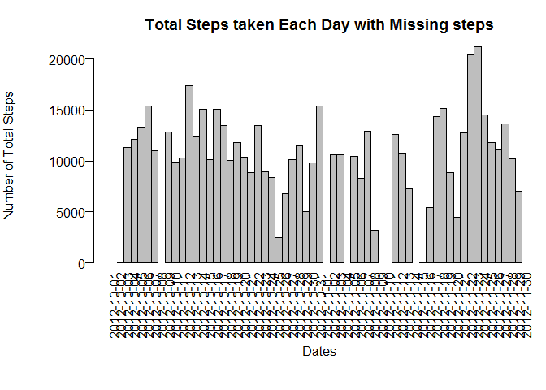
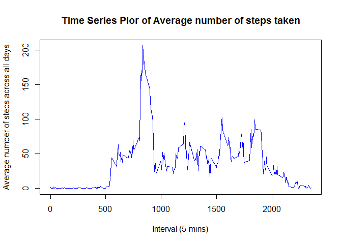
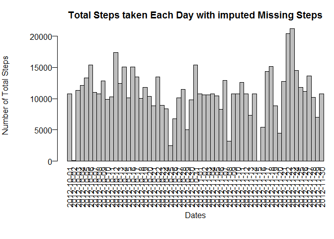
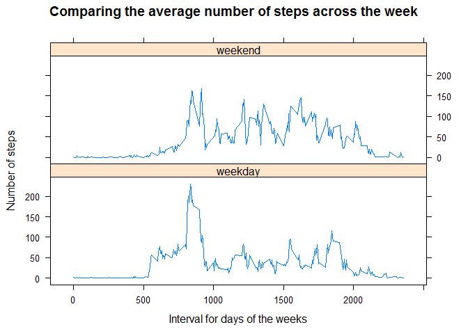

# PA1_template.md
Naing Naing Aung  
March 7, 2016  

This is an R Markdown document. 

# Loading and preprocessing the data

```r
library("knitr")
library(plyr)
library(ggplot2)
library(grid)
library(lattice)

activity <- read.csv("activity.csv", header = TRUE)
totalsteps <- aggregate(activity$steps, list(activity$date), sum)
names(totalsteps) <- c("eachdate","addsteps")

intervalsteps <- aggregate(steps ~ interval,  data = activity, mean)
maxsteps <- which.max(intervalsteps$steps)
intervalsteps[maxsteps,]
```

```
##     interval    steps
## 104      835 206.1698
```

# What is mean total number of steps taken per day?

```r
meansteps <- round(mean(totalsteps$addsteps, na.rm = TRUE))
print(sprintf("Mean of total steps taken per day: %i ", meansteps))
```

```
## [1] "Mean of total steps taken per day: 10766 "
```

```r
mediansteps <- median(totalsteps$addsteps, na.rm = TRUE)
print(sprintf("Median of total steps taken per day: %i ", mediansteps))
```

```
## [1] "Median of total steps taken per day: 10765 "
```

# What is the average daily activity pattern?

```r
windows()

with(totalsteps, {
  par(mar=c(6,6,3,0), oma=c(2,0,0,0), mgp=c(5,0.5,0), las=2)
  barplot(
    height=addsteps,names.arg=eachdate,space=c(0),
    main="Total Steps taken Each Day with Missing steps",
    xlab="Dates",
    ylab="Number of Total Steps")
})
```



```r
windows()
plot(intervalsteps$interval, intervalsteps$steps, type='l', col = "blue",
     main="Time Series Plor of Average number of steps taken", xlab="Interval (5-mins)", 
     ylab="Average number of steps across all days")
```



# Imputing missing values

```r
activitynomissingvalues <- na.omit(activity)
missingrows <- nrow(activity) - nrow(activitynomissingvalues)
print(sprintf("Total Row count with NA data: %i ", missingrows))
```

```
## [1] "Total Row count with NA data: 2304 "
```

```r
missingactivity <- subset(activity,is.na(activity$steps))
datatopopulate <- rep(intervalsteps,8)
names(datatopopulate) < c("inerval", "steps")
```

```
##  [1] FALSE FALSE FALSE FALSE FALSE FALSE FALSE FALSE FALSE FALSE FALSE
## [12] FALSE FALSE FALSE FALSE FALSE
```

```r
missingactivity$steps <- round(datatopopulate$steps)
newactivity <- rbind(activitynomissingvalues,missingactivity)
totalstepsnomissinvalue <- aggregate(newactivity$steps, list(newactivity$date), sum)
names(totalstepsnomissinvalue) <- c("neweachdate","newaddsteps")

newmeansteps <- round(mean(totalstepsnomissinvalue$newaddsteps))
print(sprintf("Mean of total steps taken per day: %i ", newmeansteps))
```

```
## [1] "Mean of total steps taken per day: 10766 "
```

```r
newmediansteps <- median(totalstepsnomissinvalue$newaddsteps)
print(sprintf("Median of total steps taken per day: %i ", newmediansteps))
```

```
## [1] "Median of total steps taken per day: 10762 "
```

```r
print("Mean stay the same for both cases and Median is smaller for data without missing value")
```

```
## [1] "Mean stay the same for both cases and Median is smaller for data without missing value"
```


```r
windows()

with(totalstepsnomissinvalue, {
  par(mar=c(6,6,3,0), oma=c(2,0,0,0), mgp=c(5,0.5,0), las=2)
  barplot(
    height=newaddsteps,names.arg=neweachdate,space=c(0),
    main="Total Steps taken Each Day with imputed Missing Steps",
    xlab="Dates",
    ylab="Number of Total Steps")
})
```




# Are there differences in activity patterns between weekdays and weekends?

```r
newactivity$daytype <- weekdays(as.Date(newactivity$date))

newactivity$daytype[newactivity$daytype  %in% c('Saturday','Sunday') ] <- "weekend"
newactivity$daytype[newactivity$daytype != "weekend"] <- "weekday"

intervalstepsdaytype <- aggregate(steps ~ daytype + interval,data = newactivity,mean)
```


```r
windows()
xyplot(
  type="l",
  data=intervalstepsdaytype,
  steps ~ interval | daytype,
  xlab="Interval for days of the weeks",
  ylab="Number of steps",
  main = "Comparing the average number of steps across the week",
  layout=c(1,2)
)
```




